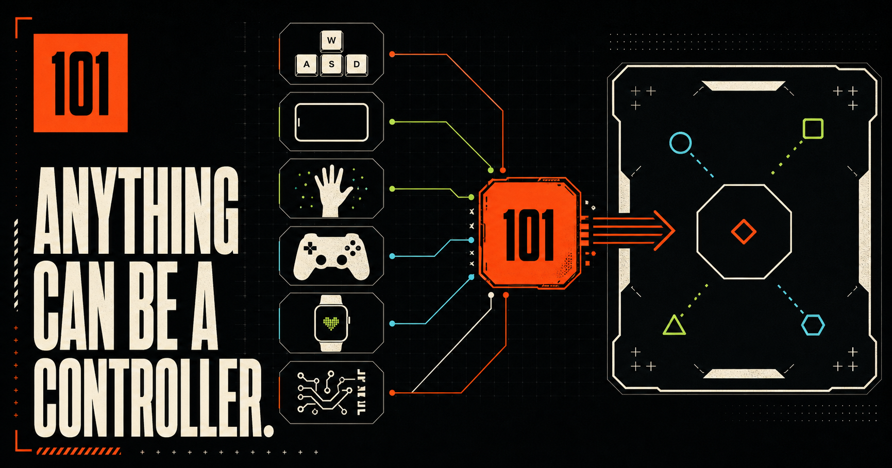

# 101

**One local gaming runtime where almost anything can become a controller.**

101 is an open-source-first, local-first, browser-first gaming platform. Games consume normalized actions such as `move`, `aim`, `slash`, and `pose`; adapters handle keyboards, pointers, gamepads, phones, cameras, watches, and future hardware.

This repository currently contains the **networking, motion, local vision, rhythm, physics, deterministic-maze, scalable-swarm, and asymmetric-session foundation plus all ten playable game slices**: the launcher, manifest-driven catalog, core contracts, 101 Input Bus, role-aware session host, JSON-defined controller surfaces, renderer/physics/audio facades, deterministic generation utilities, engineering Labs, Slashstorm 101, TiltDrift 101, BodyDodge 101, Orbital Crew 101, BeatForge 101, GravityStack 101, Spellcaster 101, Echo Maze 101, Shadow Arena 101, and Swarm Commander 101. It deliberately does not present the native Link app, watches, automatic LAN discovery, hardware adapters, desktop Hub, or production reconnect as finished.



## Run it

Requirements: Node.js 22.13 or newer.

```bash
npm install
npm run dev
```

Open the local address printed by the development server. The Input Lab supports:

- WASD or arrow keys to move
- pointer or touch to aim
- click, Space, or gamepad A to trigger
- a same-browser 101 Link controller opened from **Connect device**

Slashstorm 101 is playable from the launcher with pointer/touch, keyboard, gamepad, or the browser Link controller. Its infinite spawn director uses seeded randomness and combines target groups, hazards, armor, bonuses, pacing, and escalating difficulty.

TiltDrift 101 is a playable Three.js racing slice. Use Left/Right or A/D to steer, Space to boost, Down/S to brake, and Shift/X to drift. Its tested road grammar produces continuous, seed-repeatable spline-like segments, bounded widths, changing environments, and traffic combinations.

The **Motion Lab** requests sensor permission only after an explicit click, corrects screen orientation, calibrates a neutral quaternion, filters noisy acceleration/rotation, recognizes gestures with hysteresis, and publishes normalized tilt/steer frames through `@101/adapter-motion`. A keyboard simulation makes the pipeline inspectable on desktops without sensors.

The **Vision Lab** uses bundled MediaPipe code, WASM, and local pose and hand models—there is no runtime CDN. Camera permission follows an explicit click, raw frames remain in the browser, and the 101 classifiers turn 33 body landmarks or 21 hand landmarks into calibrated body actions, stable hand poses, swipes, and circles. Keyboard simulation exercises the identical pose adapter without requesting a camera.

BodyDodge 101 is a playable Three.js survival slice. Move or lean left/right, duck, jump, or raise both arms to pass an infinite deterministic gate grammar. Camera pose is optional; keyboard and gamepad mappings are available immediately.

Orbital Crew 101 is a playable asymmetric co-op slice. Up to five browser Link devices are assigned pilot, weapons, shields, reactor, and emergency roles, each with a different host-defined panel and live ship readout. A keyboard or gamepad captain can operate every station without any connected device. Its seeded sector director overlaps multi-role threats and schedules deterministic boss encounters.

BeatForge 101 is a playable endless rhythm/movement slice. A reusable `@101/rhythm` clock grades input in time-based windows while the seeded director varies BPM, subdivisions, actions, and compatible two-action chords. Keyboard, gamepad, Link motion, and optional local body pose all reach the same semantic beat actions. Its short cues are generated locally through `@101/audio`, so no remote or licensed music asset is required.

GravityStack 101 is a playable endless variable-gravity tower. Its game module sees only opaque 101 physics handles and normalized `gravity`, `placeX`, and `drop` controls; Rapier remains inside `@101/physics`. A phone can rotate gravity while a conventional player places pieces, or a second Link device can receive a dedicated builder panel.

Spellcaster 101 is a playable seeded survival arena built around a reusable temporal hand classifier. Open palm, pinch, fist, two fingers, swipe, and circle become the same `spell.cast.*` events emitted by phone motion, keyboard, and gamepad adapters. The optional camera uses the bundled hand model locally; conventional controls remain immediately playable.

Echo Maze 101 is a playable endless exploration slice driven by the reusable `@101/maze` perfect-maze generator. An assigned Link scanner receives role-private target bearings, path distance, signal strength, and echo proximity. Without a phone, the required clue appears on the host, so enhanced hardware never gates progress.

Shadow Arena 101 is a playable endless silhouette-combat slice. The reusable pose classifier distinguishes left and right punches, guard, duck, jump, and deliberate two-arm specials, and the camera adapter emits the same `combat.*` vocabulary as Link, keyboard, and gamepad mappings. The body camera remains optional and local.

Swarm Commander 101 is a playable real-time strategy/action slice powered by `@101/swarm`. Spatial-hash separation and instanced rendering keep hundreds of agents responsive across cluster, line, wedge, ring, and grid formations. Mouse or hand pointing sets precise command targets, while separate Link navigator and tactician roles can steer and reshape the same collective.

The **Network Lab** creates compressed manual WebRTC offers and answers without a signaling server. It opens a reliable control channel plus an unordered zero-retransmit realtime channel and reports round-trip latency, jitter, loss, candidate path, and bytes transferred. The same-browser controller still uses `BroadcastChannel` as the fastest local test path.

The **Controller Lab** validates editable controller-layout JSON, applies it live to 101 Link, and inspects the normalized actions, axes, and vectors returned by buttons, D-pads, sticks, touch surfaces, sliders, and optional motion mappings.

## Verify it

```bash
npm run typecheck
npm test
npm run lint
npm run license:inventory
```

Production build:

```bash
npm run build
```

## Architecture

```text
101 Game
   ↓  @101/sdk
101 Engine ───── renderer / physics / audio facades
   ↓
101 Input Bus   actions · axes · vectors · poses
   ↓
101 Protocol    reliable control + disposable realtime frames
   ↓
Adapters        keyboard · pointer · gamepad · motion · camera pose/hand · future devices
```

The hard rule is simple: **game code does not import browser or hardware APIs**. A game asks for `ctx.input.vector("move")`; the runtime decides which connected source can provide it.

Key packages:

| Package | Responsibility |
| --- | --- |
| `@101/input` | Frames, normalization, stale-frame rejection, players and adapters |
| `@101/protocol` | Versioned messages, BroadcastChannel and WebRTC transports, offline pairing, compact motion packets |
| `@101/session` | Capability-aware role assignment, targeted controller layouts, heartbeats and host-side frame identity enforcement |
| `@101/sdk` | Public game lifecycle and manifest types |
| `@101/core` | Runtime lifecycle and seeded procedural utilities |
| `@101/motion` | Quaternion-based smoothing/calibration pipeline |
| `@101/adapter-motion` | Lazy browser permission, device orientation correction, gestures and normalized frames |
| `@101/vision` | Pose calibration plus hand landmark smoothing and temporal gesture state machines |
| `@101/adapter-camera` | Lazy local capture plus replaceable bundled MediaPipe pose/hand inference |
| `@101/diagnostics` | Input rate, frame age and dropped-frame instrumentation |
| `@101/replay` | Seed, input-frame and deterministic-event recording |
| `@101/rhythm` | Frame-rate-independent beat/time conversion, quantization and timing judgments |
| `@101/maze` | Deterministic connected maze generation, reciprocal walls, routing and bearings |
| `@101/swarm` | Centered formation grammars, spatial-hash separation, bounded steering and precision selection |
| `@101/render-2d` | Phaser facade with external input disabled |
| `@101/render-3d` | Three.js facade and adaptive pixel-ratio boundary |
| `@101/physics` | Opaque handles, world stepping, runtime gravity and narrow Rapier operations |
| `@101/audio` | Howler-based music/SFX facade plus generated offline tone cues |

Read [the architecture guide](docs/architecture.md) for invariants and package boundaries.

## Add a game

Every game owns a `manifest.json`. The launcher discovers manifests at build time; it does not contain a hand-maintained list.

```ts
import { Game101 } from "@101/sdk";

export default Game101.define({
  id: "my-game",
  initialState: () => ({ score: 0 }),
  start(ctx) {
    ctx.input.bind("move");
    ctx.input.bind("trigger");
  },
  update(ctx, delta) {
    const move = ctx.input.vector("move");
    const trigger = ctx.input.action("trigger");
    // gameplay only — no networking, permission, or hardware code
  },
});
```

See [game development](docs/game-development.md) and [adapter development](docs/adapter-development.md).

## Repository map

```text
app/                 launcher and browser-controller surfaces
packages/            versioned 101 runtime boundaries
games/               manifests plus independently playable game code
docs/                architecture, protocol, privacy and contributor guides
tools/               release and license tooling
tests/               production-render smoke tests
```

The root web surface stays at `app/` because the browser-hosting runtime expects it there. Native and desktop application targets will live under `apps/` as they enter their implementation phases.

## Foundation milestones

- [x] Strict TypeScript workspace and browser launcher
- [x] SDK, core runtime and manifest-driven catalog
- [x] Input Bus with keyboard, pointer/touch and Gamepad adapters
- [x] Transport-independent protocol plus fixed-size motion codec
- [x] 2D, 3D, physics and audio facades
- [x] Seeded randomness, replay contract and input diagnostics
- [x] Playable Input Lab and same-browser Link controller
- [x] Strict-local WebRTC control/realtime channels and manual offline pairing
- [x] Network Lab with latency, jitter, loss and connection-path diagnostics
- [x] Slashstorm playable vertical slice with seeded infinite director
- [x] Calibrated Motion Lab with raw/filtered diagnostics and keyboard simulation
- [x] Dynamic browser Link roles that switch sword/classic/steering panels without reconnecting
- [x] TiltDrift playable 3D slice with a continuous seeded road director
- [x] Bundled local MediaPipe pose adapter and Vision Lab with simulated fallback
- [x] Pose landmarks available through `ctx.input.pose()` and semantic body actions
- [x] BodyDodge playable 3D slice with a validated seeded gate grammar
- [x] Protocol v2 with targeted JSON controller layouts and live role state
- [x] Capability-aware session roles with stable assignment and host-verified frame identity
- [x] Orbital Crew asymmetric slice with five Link roles and a seeded infinite sector director
- [x] Controller Lab for validated custom layouts and live normalized-frame inspection
- [x] Frame-rate-independent rhythm package and BeatForge endless movement slice
- [x] Opaque Rapier handles, rotating gravity, and GravityStack two-role physics slice
- [x] Bundled local hand landmarks, temporal gesture state machine, and switchable Vision Lab
- [x] Spellcaster slice with identical semantic spells from camera, phone motion, keyboard, and gamepad
- [x] Deterministic `@101/maze` generator and Echo Maze private companion-display slice
- [x] Reusable combat-pose vocabulary and Shadow Arena camera/Link/conventional-control slice
- [x] Scalable `@101/swarm` formations, spatial steering, and Swarm Commander specialist-role slice
- [ ] Automatic LAN discovery, reconnect and QR encoding
- [ ] Native 101 Link sensor and haptic controller
- [ ] Face/head landmark adapter plus richer multi-hand gesture vocabularies
- [ ] Tauri Hub, watches and optional hardware adapters

## Privacy and offline behavior

The launcher and game runtime require no account, analytics, database, or cloud gameplay service. Runtime dependencies are bundled. The architecture requires camera, motion, and microphone processing to stay local by default, with clear permission copy and no recording. See [privacy and security](docs/privacy-security.md).

## License

101-authored source is available under the [MIT License](LICENSE). Dependencies retain their own licenses and copyright. See [THIRD_PARTY_NOTICES.md](THIRD_PARTY_NOTICES.md) and the generated `THIRD_PARTY_LICENSES.json` inventory.
